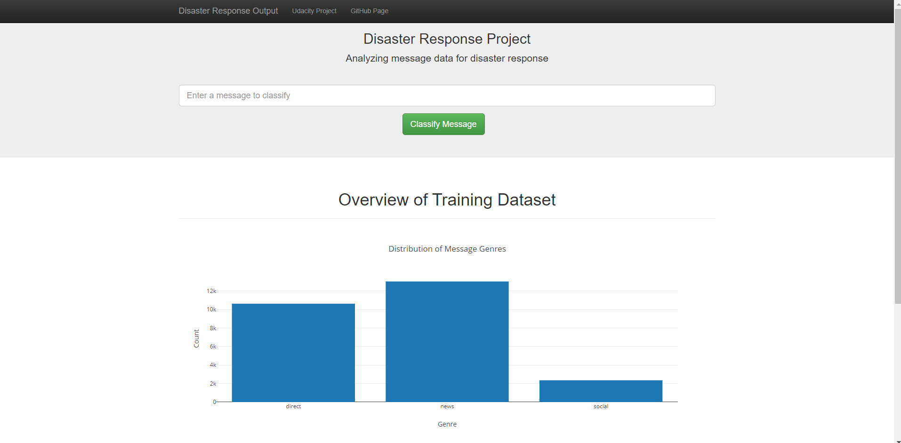
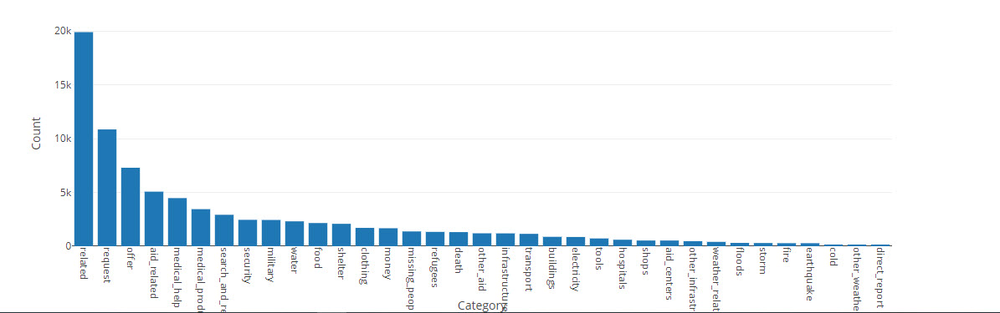

# Disaster Response Web Application

*Disaster Response Web Application* is a part of udacity 
project which is created as an web app that can help 
emergency organizations analyze incoming messages and classify the messages 
into specific categories during a disaster event. 
The app is based on Nature Language Processing and Random Forest Classifier ML model
which also has been tuned and cross validated using grid search. 
The data was collected by Figure Eight and provided by Udacity.


The techniques which has used in this project include:

- SQLite in Python
- Bag of Words (BOW)
- Multilabel classification
- Build Machine Learning Pipeline
- Grid Search Cross Validation
- Random Forest Classifier
- K nearest neighbors (KNN)
- Build a Flask web app 


## Data
The data files associated with this project are from 
[Figure Eight](https://www.figure-eight.com/dataset/combined-disaster-response-data/)

- disaster_messages.csv: FIgure Eight provide 26,248 messages
- disaster_categories.csv: Raw categories data, total 36 categories.

## Project Process

1. ETL Pipeline
    - Loads `messages` and `categories` dataset
    - Clean data
    - Feature Engineering
    - Stores it in a SQLite database

2. ML Pipeline
    - Loads data from the SQLite database
    - text processing and machine learning pipeline
    - Trains and tunes a model using GridSearchCV
    - Exports the model

3. Build web app
    - Create HTML templates
    - Build Flask web application


## Folder Structure

```
├── README.md          
│
├── models                       <- Trained models and ML pipeline
│   ├── disaster_model.pkl       <- Saved model
│   └── train.py                 <- Scripts to train model sdf
│
├── requirements.txt             <- File for reproducing the environment
│
├── data                         <- Raw and processed Data; data     
│   │                             cleaning script
│   ├── disaster_messages.csv    <- Raw messages data
│   ├── disaster_categories.csv  <- Raw categories data
│   ├── disaster_response.db     <- Saved processed data
│   └── etl_process.py           <- Scripts to process data
│
├── notebooks                <- Jupyter notebooks
                              ( along with input files/generated models/db)
│
└── App                      <- Source code for use in this project.
    ├── templates            <- Flask html templates 
    └── run.py               <- Scripts to create start Flask server. 
```

## Full Instructions

- Installation
    Install Python 3.7+
    Run ```pip install -r requirements.txt```
- Prepare data
    1. Clone or download the repo
    2. Open terminal and navigate to the project folder
    3. Run ```python data/etl_process.py data/disaster_messages.csv data/disaster_categories.csv data/disaster.db```
- Train model
    5. Run ```python models/train.py data/disaster.db models/disaster_model.pkl```

- Start Web app
    6. Run ```cd app```
    7. Run ```python run.py```
    8. Open web browser and go to http://192.168.0.21:3001/ or http://localhost:3001

## Screen Shot


<!--  -->

--------
